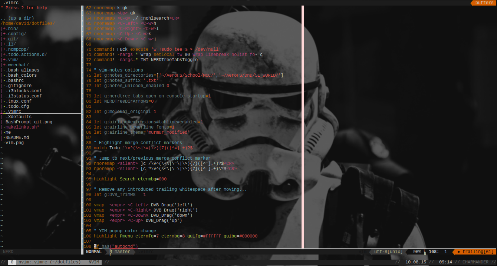

# dotfiles
Contains dotfiles for my linux systems

## .bashrc
This is what the .bashrc looks like:  

## .vimrc
This is what vim should look like (colors may vary)

.vimrc requires [Vundle](https://github.com/gmarik/Vundle.vim)

## Using this repo
To activate, run makelinks.sh
