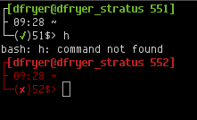
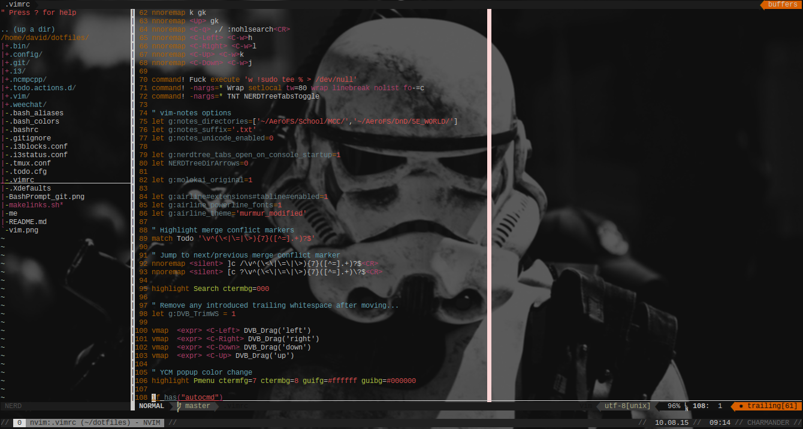

# dotfiles
Contains dotfiles for my linux systems

## .bashrc
This is what the .bashrc looks like:  


## .zshrc
Depends on my fork of [git-prompt.zsh](https://github.com/dfryer1193/git-prompt.zsh)

## .vimrc
This is what vim should look like (colors may vary)


## Using this repo
To activate or switch profiles, run `makelinks.sh` (or `dotprofile` if already linked in `~/.bin`):

```bash
./makelinks.sh [profile]
```

### Profiles
- **`default`**: Full Linux Wayland desktop setup (Sway, Waybar, Alacritty, Dunst, WirePlumber, and CLI tools).
- **`cli`**: Headless / CLI-only setup (Shell, Neovim, Tmux, Git, and CLI utilities).
- **`mac`**: macOS setup (Shell, Neovim, Tmux, Alacritty, and AeroSpace).

### Commands
- `./makelinks.sh status` — Show active profile.
- `./makelinks.sh list` — List available profiles.
- `./makelinks.sh <profile>` — Switch to profile and update symlinks.
